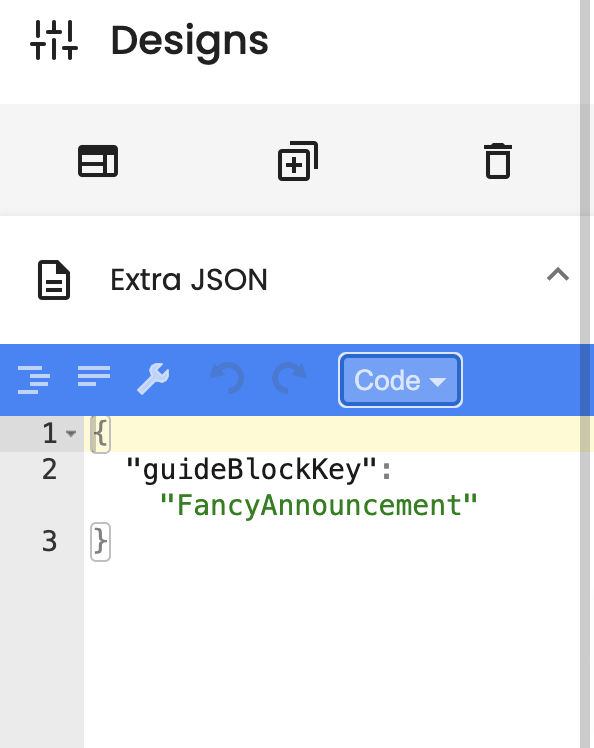

This sample application show's Contextual SDK for both no-code and low code use-cases.

# No Code

1. Create an account at [Contextual Dashboard](https://dashboard.contextu.al/ "Contextual Dashboard").
2. Install the Contextual SDK following the instructions for IOS or Android.
3. Follow this [video]( https://player.vimeo.com/video/733886063?h=c799c48907&amp;badge=0&amp;autopause=0&amp;player_id=0&amp;app_id=58479  "Guide Creation How-to") for more step-by-step guide creation.

# Extensibility (Low Code)

Like something Contextual doesn’t offer in our Standard Components? Contextual provide a powerful capability to use your favourite open source components or even your own in-App elements as part of Guides. We call these "GuideBlocks".

## Fancy Announcement

In this example, we show how to make a Fancy Announcement, just like the crazy ones your Designer comes up with 🤣. Its a simple example to get you started with Contextual Extensibility without needing to hard-code your changes every time you want to update the tip.

1. Create an account at [Contextual Dashboard](https://dashboard.contextu.al/ "Contextual Dashboard").
2. Install the Contextual SDK following the instructions for IOS or Android.
3. Open src/components/Tab1.js and add the sample wrapper code for  *FancyAnnouncement* to your App.
4. Copy-Paste the instantiation of the Guide Component AFTER the Contextual SDK registration.
5. Build your App and Run it.
6. Click on the Contextual Creator (the Chrome extension) and create a guide:
 * Pick one of the “Standard” Contextual Announcement Templates.
 * Use this [video]( https://player.vimeo.com/video/733886063 "Web Guide Creation How-to") to see the steps
 * Preview the Announcement on your Phone - it should look similar to the template
7. Now go to the Extensibility section (Extra JSON) in the sidebar and paste in the JSON as follows:
   
`
{
  "guideBlockKey": "FancyAnnouncement"
}
`

 * Match the name in the JSON to the name of your wrapper in the code

 

8. If you are still in Preview Mode (or when you run the App with the guide enabled), then you should see the Announcement will magically change to Fancy Announcement
9. Change the Title and Content and buttons. Play around with it and see the results.
10. Save the guide and show to your Product Team, once you release this version of the App they can launch Fancy Announcement to whoever they want, whenever they want.
>>>>>>> f4fa3130c015f93cda98fcfa49ca992c44bd75f6
